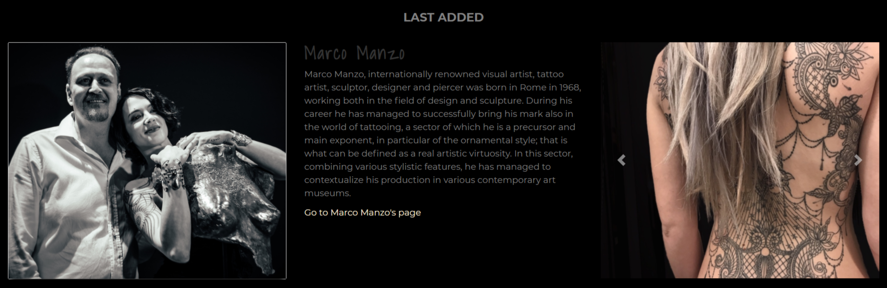

# Get My Tattoo

For the third Milestone Project, I decided to design a website where tattoo artists can register and add their profile to a database. Users (customers) can then search the database without registering and find their ideal tattoo artist.
I had this idea since it is not easy to find a tattoo artist that does exactly what we want. This research might take a considerable amount of time, and people nowadays have always less free time. People need to find information easily and fast.
The structure of the website is divided into two: one area is visible to all users, and one area is visible only to registered users.

View the live project here. [Get My Tattoo](https://getmytattoo.herokuapp.com/get_artists)

### Base Page

The base page has elements that all the pages have in common, which are a sticky navbar with collapsible toggler and a search box, plus a footer.

### Home Page

The home page welcomes the users and explains briefly what the website is about.
Then a section with four cards shows some tattoo styles to inspire users, but also to guide them through the navigation. Many times users don’t have a clear idea in mind and need a guide to help them to start the navigation.

Right after this section, I repeated the search box and an area with the last 5 tattoo artists that added their profile.
All users can access this page and search freely the database.

### Search Page

The search page displays the results of the user's research.

For each result, there is a row with a profile picture of the tattoo artist (on the left), an information section (on the center) displaying the name of the artist and his/her biography, and a carousel (on the right) with three pictures of the artists’ tattoos.
In this way, the user can understand at a glance if the tattoo artist might be of interest, or not. 
In case the user wants to know more about one tattoo artist, there is a link at the bottom of the central information section that leads directly to the artist page.
A target attribute has been added to the link that leads to the artist's page: in this way the user doesn't lose the search results if clicks on a link.

### All Artists

This page displays all the artists in the database, in alphabetical order.

### Show Styles

That page displays a list of artists who share the same tattoo style.

The layout is the same as the artists' section on the home page.

### Show Artist Page

This page displays all the information about a single artist.
Here users can find the address, the contact area, information about the languages that the artist speaks, the style he/she has, and a gallery with up to six images showing some of the best work of art the artist made.
A bottom at the end of the page takes the user back to the home page. 

### Register - if the user is a tattoo artist

The register page has an image on the background of a bearded tattooed man that looks in the direction of the form.
The form has two fields: username (that accept letters from the Latin alphabet and numbers) and password (with a length between 5 and 20 char).
A small text under the section has a link to the login page for those users that already have an account.

### Log In - only for tattoo artists

This page repeats the same structure as the register page.
If a user writes a wrong username or a wrong password, a message tells that there is some mistake.

### Add profile - only for tattoo artists

This page is visible only after a user registered his/her profile and is not available from the menu.
That because a user is allowed to have only one profile.

A form with all the fields needed is shown. Here the tattoo artist can add:
* name
* address
* city
* country
* profile picture (URL)
* phone number
* email
* link to Facebook
* link to Instagram
* languages spoken
* tattoo style
* up to six images (URL)

A button lets the user save the profile.

### Edit profile - only for tattoo artists

This page takes the same layout of the “Add profile”, but instead of having empty fields, it shows the values that the user already added before.
Clicking on the fields, the user can delete the content and type something new.
At the bottom of the page, there are two buttons: one allows the user to save the changes, the other one allows to cancel the changes without saving.

### Delete profile - only for tattoo artists

This page allows the tattoo artist to delete his/her profile.
However, to prevent unintentional deleting, I added an extra step. 
The page asks for confirmation: if the user really wants to delete the profile, then a button cancels the profile and takes the user back to the general home page.
If the user changes his/her mind and wants to go back, a button guides him/her to the profile page.

### My profile - only for tattoo artists

This page shows the artist’s page with the information that he/she provided.
A button allows the user to edit the profile (linking to the “Edit profile” page, and one button to delete it (linking as I mentioned before to the “Delete” page.

---

## User Experience (UX)

* **Strategy Plane**

The website should help tattoo artists getting in touch with new customers.
It should be a window for artists to show their abilities, and at the same time allows users to find their ideal tattoo.

When a person is looking for a new tattoo, he/she wants to find a person that is able to transform the idea into a permanent design. Not all tattoo artists do the same things, they are always specialized in some particular styles. 

Moreover, it is always better when customers and artists speak the same language. They can communicate properly and share ideas, feelings, etc.
We live in a world where immigration is a common thing, we have around people coming from all over the world and language is not always the same (or at the same level). This is something that I experienced directly, as an Italian living in Sweden.
Also, we live in a society where it is easy to move from one city to another, but also from one country to another: it happens often that customers are willing to travel just to have the tattoo done by a specific person. 

There are two big websites that have a great database for tattoo artists: [Tattodoo](https://www.tattoodo.com/) and [Inkstinct](https://inkstinct.co/). They have very rich search options, but they are missing the language thing and they are too confusing. They don’t go straight to the point as my website wants to do.

According to an article that appeared on [Medium](https://medium.com/daliaresearch/who-has-the-most-tattoos-its-not-who-you-d-expect-1d5ffff660f8), the average person nowadays that has a tattoo is a person with high education, with a good income, that lives in an urban area.
The idea of the tattooed person as an “outsider” is no longer actual and I think that the design of the website should reflect this aspect. It should be intuitive, modern and with a strong personality.
That also should convey an idea of credibility and reliability.
The user (customer) can contact the tattoo artist in many ways: with a phone call, with an email, connecting through Facebook or Instagram.

|   | Opportunity / Problem / Feature | Importance | Viability |
|---|---------------------------------|------------|-----------|
| A | Register Functionality          | 5          | 5         |
| B | Login Functionality             | 5          | 5         |
| C |  Add Profile Functionality      | 5          | 4         |
| D | Show Profile Functionality      | 5          | 4         |
| E | Edit Profile Functionality      | 5          | 4         |
| F | Search Functionality            | 5          | 4         |
| G | Contact Artist                  | 5          | 4         |
| H | Contact Webmaster               | 5          | 5         |
| I | Paginate search results         | 3          | 3         |
| J | Logout Functionality            | 5          | 5         |
| K | Admin Functionality             | 3          | 3         |

As shown on the table, I will leave at the end the admin functionality and pagination that will come out with a second release.

* **Scope Plane**

It is very important that the tattoo artist can have his/her own virtual window as a showcase of his/her job.
To have the maximum focus on the artist it is of fundamental importance that every single artist has his/her own page with no distractions around.
Links that allow connections between artists and customers are also of fundamental importance.
To help the tattoo artist editing and updating the profile anytime, there must be a functionality to do it independently.
Also, to keep the information on the website consistent for all the tattoo artists, it should not be allowed for a tattoo artist to add extra fields. In this way, everyone has equal instruments to reach and attract customers.

* **Structure Plane**

The sticky navbar allows users to navigate easily on the website without going back and forth wasting time, considering also that the website has many pages and without a sticky navbar the user can easily get lost.

The search bar, a fundamental feature, is placed on the navbar and is also repeated on the home page.

All the buttons have a glowing effect on hover, to add focus and attract the user. At the bottom of almost every page there is a button that allows the user to do something: for example, to edit the profile, delete it, or go back to the home page.

A smooth scrolling effect adds some extra class and modernity, obtained with ScrollReveal.js.

Validation on forms is adapted and customized from Bootstrap JavaScript validation. A feedback tells the user if the fields are correctly filled or not.
This validation also prevents the form from being submitted with invalid fields.

The website is divided into two different structures: one is for all the users, one is only for registered users (in this case, only for tattoo artists).

The structure visible to all users includes the home page and the search functionality, which allows anyone to access tattoo artists' profiles.

The other structure level is dedicated only to tattoo artists. They can register with a username and add their profile, which will be visible to anyone. 
Tattoo artists can also edit their own profile or delete it directly without contacting an admin of the website.

* **Skeleton Plane**

The pattern design is consistent throughout all the pages.

You can view my prototypes by clicking on the following links:

* [Mobile Prototype](static/documents/wireframes/mobile.pdf)

* [Desktop Prototype](static/documents/wireframes/desktop.pdf)

Prototyping has been made with Adobe XD.

While coding I changed a little bit the layout because new ideas came to my mind, so the final result is a little different from the prototype.

* **Surface Plane**

The absence of colours is dominant in this website.

I decided to make black and grey the main characters of the design because I wanted to give the feeling of ink and tattoos on the screen.

### User stories

#### First Time Visitor Goals

* As a user interested in tattoos, I want to find easily information about tattoo artists in my area.
* As a user interested in tattoos, I want to find easily information about tattoo artists specialized in a particular tattoo style.
* As a user interested in tattoos, I want to find easily information about tattoo artists that speak my language.
* As a user interested in tattoos, I want to browse the database just to have a look at tattoos pictures.

* As a tattoo artist, I want to add my profile to get new customers.
* As a tattoo artist, I want to have a look at my competitors' works.
* As a tattoo artist, I want to contact the owner of the website.

#### Returning Visitor Goals

* As a user interested in tattoos, I want to contact a specific tattoo artist.
* As a user interested in tattoos, I want to have a look at the last added tattoo artists.

* As a tattoo artist, I want to edit my profile.
* As a tattoo artist, I want to delete my profile.

### Design

The website has a simple layout based on Bootstrap cards and Bootstrap forms.
I customized the design to make it more tailored to my needs and my vision.

### Colour Scheme

The colour palette is very basic, but the shades have been accurately chosen according to different criteria:
* overall harmony of shades;
* no eyestrain;
* evocation of the tattoo and ink concept.

Colour Palette created with [Coolors](https://coolors.co/)

To make the design more tridimensional and deeper, I used a shadow box on images. 

Buttons on hover have a white glowing effect that looks like they are coming out from the screen.

I changed the shades of green and red that came with Bootstrap JavaScript Validation, because the visual effect on the grey background was disturbing.

I darkened them with:

* [#006644](https://www.colorhexa.com/006644) for valid field;

* [#660022](https://www.colorhexa.com/660022) for invalid field.

### Typography

For this project, I decided to pair Montserrat with Shadows Into Light, two Google Fonts that I think are great for this website.

Montserrat, which is modern and clear, has been used for almost any text on the website.

Shadows Into Light, which is a cursive font, has been used for flashed messages and for the tattoo artists' names. This font is very appropriate with the style of tattoos, and I chose it to remind of a handwritten signature.

### Imagery

Images have been taken mostly from other tattoo websites or artists' real profiles.

### Wireframes

Wireframes have been made with Adobe XD.

You can take a look at them here:

* [Mobile Prototype](static/documents/wireframes/mobile.pdf)

* [Desktop Prototype](static/documents/wireframes/desktop.pdf)

### Features

The website is responsive on all screens.

The sticky navigation bar collapses into a toggler on tablets and smaller screens.

Despite having many pages, the content is easily navigable thanks to the links provided in the navigation bar.

The search box also helps the user to find easily a specific content.
I decided to add the target attribute to search results. In this way, when a user clicks on a specific result to access more details, a new tab is opened and the user doesn't lose the results page.

Images guide the user through the navigation, and a carousel on artists' previews give the chance to access more content without clicking or moving the mouse.

Globally, the website is easily readable, links are easy to understand.

### Features to implement

I would like to add an admin dashboard, where an admin can perform various tasks and keep track of users' activity.

I would like also to connect the website with a payment system, to make the log in function accessible only to users that have paid a fee.

Other things to implement in the future, are better accessibility and pagination, plus an improved styling for extra-small screens.

Another thing will be adding custom meta content for description for each page, using Jinja language.

---

## Technologies Used

### Languages Used
* HTML5
* CSS3
* JavaScript
* Python 3.8.6

### Frameworks, Libraries & Programs Used

* Bootstrap 4.5.0.
* Google Fonts
* Font Awesome 4.7.0.
* Git
* GitHub
* GitPod
* Heroku
* Randomkeygen
* Chrome DevTools
* Adobe XD
* Favicon.ico
* Html Validator
* CSS Validator
* Flask 1.1.2
* Flask-PyMongo 2.3.0
* pymongo 3.11.1
* Werkzeug 1.0.1
* MongoDB
* Autoprefixer CSS 9.7.6
* Am I responsive?
* ScrollReveal.js
* Techsini mockup generator

---

## Testing

### Functionality Testing 

All the links are working, both internal and external.

The form validation is also working, it prevents the user to submit the form with invalid fields and helps to understand which ones need to be corrected.

I realized that the validation JavaScript code should be reinforced with regEx, since it allows a user to type for instance "123" in the phone number field, which is obviously not correct.
It is made by numbers, but there are no phone numbers in the world with only 3 digits.
This is something I will implement in the future.

The register functionality works properly, it displays the "app-profile" page which is reachable only after a new user registers.

After adding the informations, I have tried to edit successfully the profile: all the previous informations added by the user are visible inside the input areas, and it is possible to edit them.

And finally I tried to delete the profile successfully:

At this point, the user is still logged in because the username hasn't been deleted, only the profile.

It is still possible for the user to show again his/her profile simply clicking on "My Profile":

An empty profile is displayed, and the user needs only to edit it again with new informations.

If a user wants to delete also his/her username, he/she should contact the website owner. This is easy to do, since in the footer there is a link to contact the webmaster.

I then tested the "search" functionality by searching the word "manga":

And as expected, I can see the results displayed on the page:

I have tried to search for a word that does not exist in the database, and it correctly returns the right message that informs the user that no results have been found:

I went on testing the search method with many other words that should refer to: "name", "language", "city", "country - or state-", "style".
Everything works as expected.

I checked if the navbar highlights the right name of the page, and also this functionality works fine.

Html and Css have been validated with HTML Validator and CSS Validator.

I checked if Python is Pep8 compliant on [Pep8 Online](http://pep8online.com/) and the result was positive:

### Usability Testing

### Compatibility Testing

I tested the website not only on [Am I responsive?](http://ami.responsivedesign.is/), but also on different mobile screens that I have at home.

The functionality is working everywhere, but there are a few things that need to be fixed on smaller screens. For instance, on a Galaxy Fold which has a width of 280px, the profile image of the artist is not displayed as it should be:

On other mobile devices with a bigger width, everything is displayed as expected.

Here an example of an artist page on as it renders on IPhone 6/7/8/Plus:

### Performance Testing

The website performs well both on mobile screens and desktop; however, accessibility needs to be improved.

Speed could be improved: taking images from external urls have impact on the loading speed, since they are not optimized for the website.
This could also have a negative impact for those users that have to pay for more cellular data.

To check performance testing I used Google Test Mobile Friendly, Google Lighthouse and Google PageSpeed Insights for the home page and all-artists page.

### Bugs

As previously mentioned, there are some problems with styling on extra-small screens that need to be fixed.

---

## Deployment

---

## Credits

### Code

* Custom validation JavaScript code from [Bootstrap](https://getbootstrap.com/docs/4.0/components/forms/#custom-styles)
* Scrolling animation from [ScrollReveal.js](https://scrollrevealjs.org/)
* Changed placeholder style adapting the code from [W3School](https://www.w3schools.com/howto/howto_css_placeholder.asp)

### Media

### Acknowledgements

I want to thank my beloved husband for giving me the subject idea for this project. He is a tattoo lover and was always looking for an app like this one.

Thanks also to [Code Institute](https://codeinstitute.net/), both Tutor and Mentor Support (Spencer Barriball), for supporting and helping through the project. 
I faced a few issues with GitPod and the support has been amazing.

